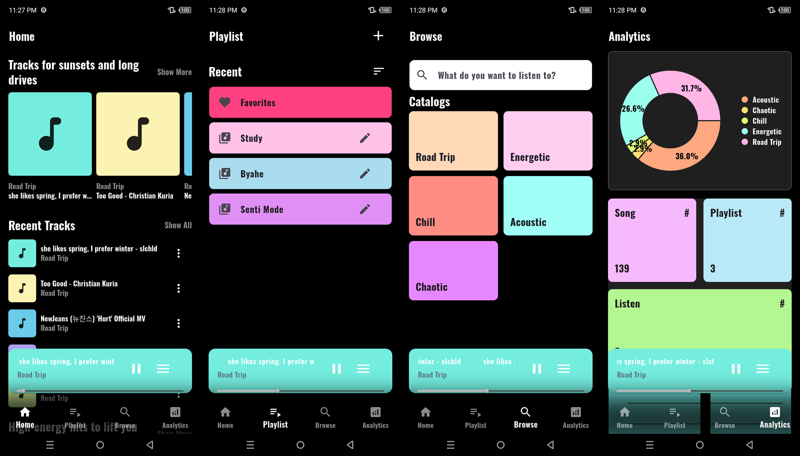

# Xvibe: An AI-Integrated Offline MP3 Music Player

## Overview

***Xvibe*** is an Offline MP3 Player embedded with a *neural network* classifier that classifies songs into vibes and is later used by Xvibe to organize, randomly recommend a list of songs, and track how your songs are distributed into categories, which are *acoustic*, *chaotic*, *road trip*, *energetic*, and *chill*.

## Features

### Home Page

* Displays songs categorized into five vibe categories:

  * *Acoustic* (Acoustic)
  * *Chaotic* (Rock and Metal)
  * *Road Trip* (R&B and Reggae)
  * *Energetic* (Country, Disco, and Pop)
  * *Chill* (Blues and Jazz)
* Displays recently listened songs from the current day.
* Displays the Top 25 most-listened songs based on listen count.
* Displays a Mix For You category containing randomly selected and recommended songs from the user's music library.

### Playlist Page

* Create and customize playlists.
* Browse favorites.

### Browse Page

* Search songs by title.
* Browse songs organized by vibe categories.

### Analytics Page

* View the distribution of songs across vibe categories.
* View the total number of songs.
* View the total number of playlists.
* View the total number of listened-to songs.
* Track daily listening activity for the past 7 days.

### Music Players

#### Mini Music Player

* Play and pause songs.
* Browse the current queue.
* Play or remove songs from the queue.

#### Notification Music Player

* Play and pause songs.
* Skip to the next or previous song.
* Stop playback directly from notifications.

#### Main Music Player

* Play and pause songs.
* Skip to the next or previous song.
* Add or remove songs from favorites.
* Browse the current queue.
* Play or remove songs from the queue.
* Shuffle the current queue.
* Repeat the current song.

### Other Features

* Automated song labeling using a neural network classifier that categorizes songs into:

  * *Acoustic* (Acoustic)
  * *Chaotic* (Rock and Metal)
  * *Road Trip* (R&B and Reggae)
  * *Energetic* (Country, Disco, and Pop)
  * *Chill* (Blues and Jazz)
* Update song titles and vibe classifications.
* Delete songs from the library.
* Song queue management.
* Share songs.
* Set songs as ringtones.

## Application Technologies
Dart, Flutter, SQLite, TFLite, Hive.

## ML Technologies
* Python, TensorFlow Keras, NumPy, Pandas, Scikit-Learn, Jupyter, YAMNet. 
* Check the neural network classifier model, here: <a href="https://github.com/Austine0829/music-vibes-classification" target="_blank">View Repository</a>

## Architecture
- MVVM
- Layered

## Screenshots




## How to run the project

### Prerequisites

* Ensure your device is already connected to your machine(Skip if using an emulator).
* Phone is already in developer mode, and debugging mode is enabled(Skip if using an emulator).
* Git

### Clone the Repository

```bash
git clone https://github.com/Austine0829/xvibe-offline-mp3-player.git
cd xvibe-offline-mp3-player
```

### Install the packages
```bash
flutter pub get
```

### Run the Application
```bash
flutter run --release
```
